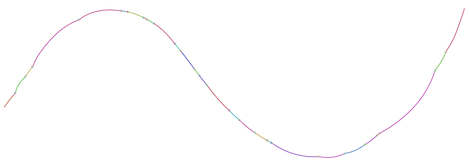

# graphite [](https://travis-ci.org/urbanslug/graphite)

A variation graph tool in racket.



## Compile
Install [Racket]

Get the code
```
git clone https://github.com/urbanslug/graphite.git
```

Actually Compile
```
cd graphite/
make
```

## Running
### Graph construction
#### Generate a gfa
```
./bin/graphite construct \
 -o z.dot \
 -f dot \
  data/1mb1kgp/z.fa  data/1mb1kgp/z.vcf 
```

#### Generate a dot
```
./bin/graphite construct \
 -o z.gfa \
 -f gfa \
  data/1mb1kgp/z.fa  data/1mb1kgp/z.vcf
```

### Graph update
Output a .gra file (a format specific to graphite/racket)
```
./bin/graphite construct \
 -o rsv1.gra \
 -f gra \
data/RSV/refererence_and_vcf_file/9465113.fa data/RSV/refererence_and_vcf_file/H_3801_22_04.freebayes.vcf
```

Update the graph and output a dot format or whatever other format you'd like:
```
./bin/graphite update \
 -o rsv2.dot \
 -f dot \
 rsv1.gra data/RSV/refererence_and_vcf_file/fake_H_3801_22_04.freebayes.vcf
```

## Visualization

Generate a visualization out of a gra(serialized graph)
```
./bin/graphite view \
 -o rsv1.dot \
 -f dot \
 rsv1.gra

```

### GFA
Load the GFA file into [bandage].

### Graphviz
Generate svg out of .dot
```
$ dot -Tsvg -o z.svg z.dot
```

## Documentation
To be found at [official graphite docs].

The Google Summer of Code 2019 submission link: [Google Summer of Code 2019—Final Submission].
You could also find other related posts under the [graphite tag].

## Test
Run all tests
```
$ raco test -p graphite
```

Run tests on a specific module
```
$ raco test -m tests/run-all-tests.rkt
```

## License
[GNU GENERAL PUBLIC LICENSE Version 3](LICENSE)


[bandage]: https://rrwick.github.io/Bandage
[official graphite docs]: https://urbanslug.github.io/graphite/
[graphite tag]: https://blog.urbanslug.com/tags/Graphite.html
[Google Summer of Code 2019—Final Submission]: https://blog.urbanslug.com/posts/2019-08-20-Google-Summer-of-Code-2019-Final-Submission.html
[Racket]: https://www.racket-lang.org/
